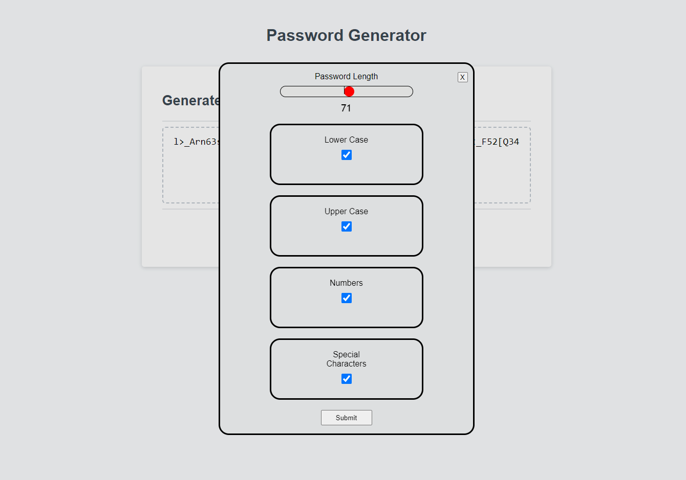

# Dylan_Polito-Password_Generator

## Description

I created this project to learn more about javascript logic. I set out to better understand objects as well. Objects in javascript have been a weak point for me, and I wanted to better learn how to use them. 

The project is a simple password generator. It takes 5 pieces of criteria (lowercase, uppercase, numbers, special characters, and length) and will spit out a password with whatever criteria you pick.

This project helped me to better understand how to create objects, and access/destructure the contents of the objects. 

